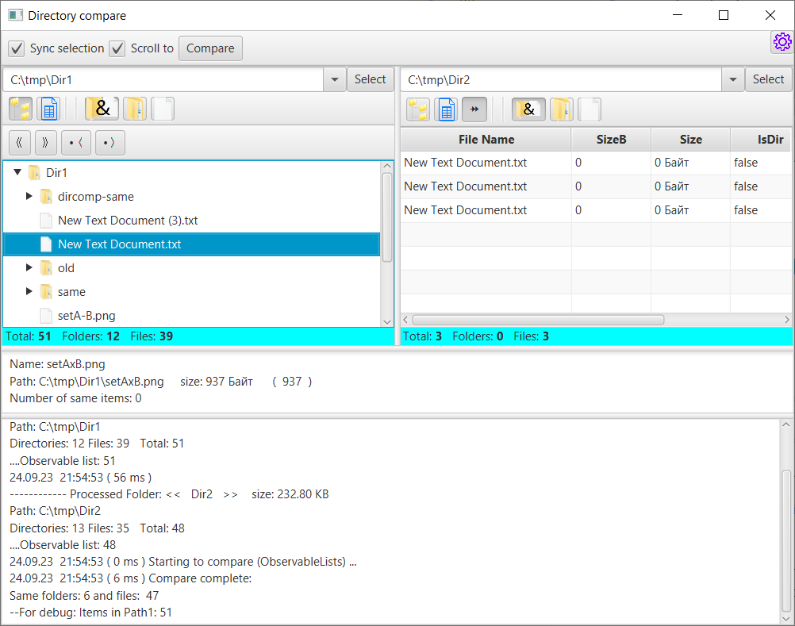
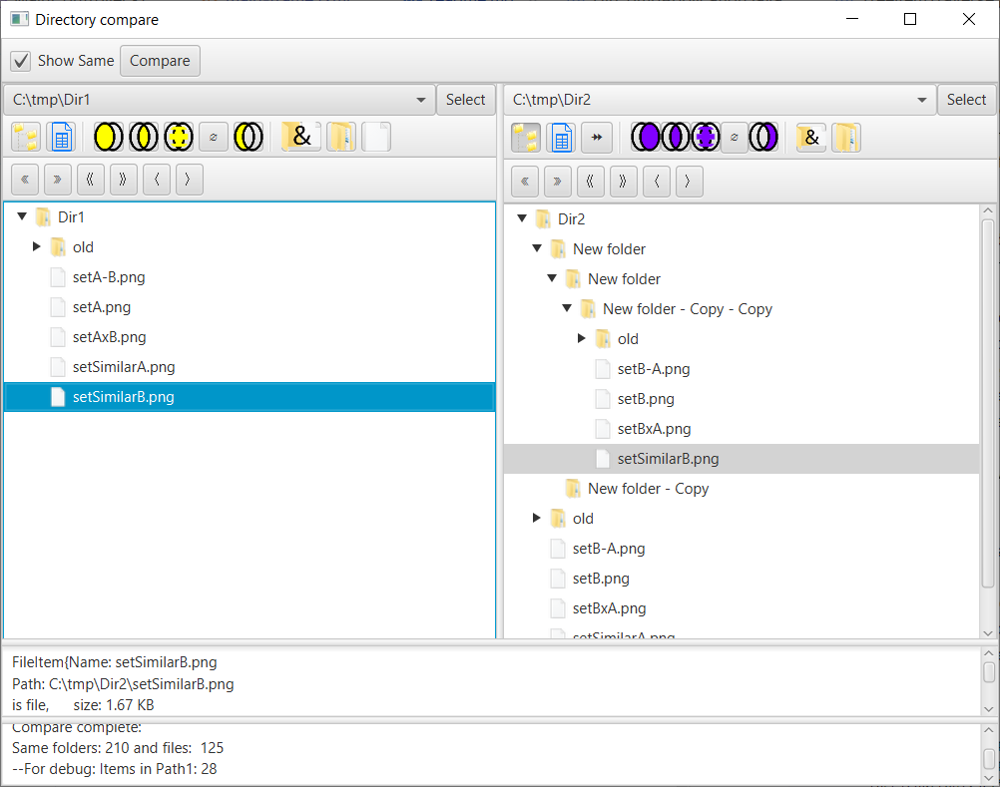

To Do:
- add same statistics to status bar
- If sme directories - files duplicate both added
- Compare doesn't cleared after multiple launch
- -when delete file, exclude it from the ame list either
- add graphic representation
- add strings for hints and titles

- add colum num copies

- progress label - display tracing Dir (1,2) before comparing
- add tableView
- Open Path in explorer
- Button cancel size
Collaps/ expand

When delete file, remove ot both from Tree and Observable lists
Edit ComboBox text with single click - double click opens Directory open dialog
If the same folder selected - process duplicates only ignoring files with the same path

- scroll to text area Status 
add modal window to ask beforepe peramnent deltetion
switcing table view treeView
ProgressBar Comparision tracking x100
delete to recycle bin
- add tahs #delete every where file delete operation
- configure Icons with x2 x3 xN (Showing number of duplicates)
- Adding TableView decoration to highlight outstanding items
- remade content mennu for TreeView
- whe files - the first directory ignored
- During compaision save Obseved List of links to same and similar Objects
- add settings tab setup path to move items instead of delete during testnig
- Add Union intersect subtract

- When find same in other set and selected it - scroll to it 
- sync Tree <-> Table
- add notifiacation about found same copies when selected e.g. label
Bugs:
- - fix collase/ expand Treeview
- Check why ProgressBar shows incorrect values after "Cancel"
- Double click on Toggle button cacel highliting as selected
- - add notification about found same copies when selected e.g. label
- Double Click listeners in TreeView and TabView registered and check boxes are just prevent to implement Listner processes (Maybe better to register / clear listeners)
        toggleButton1.selectedProperty().addListener((observable, oldValue, newValue) -> {
            if (!newValue && group.getSelectedToggle() == toggleButton1) {
                toggleButton1.setSelected(true);
            }
        });

Done:

✓ Double ContentMenu 
✓ Double click try to open
✓ Add RMB Item open in explorer
✘ Process FileItiem extended to File (too slow)
- calculate directory sizes

